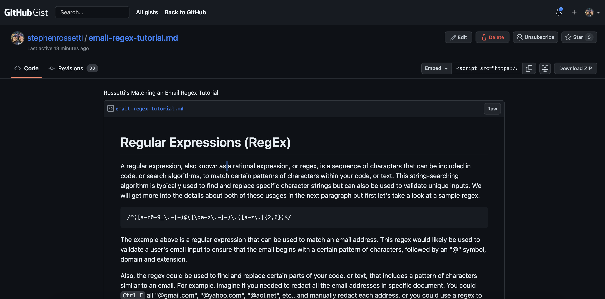

# Rossetti-s-Computer-Science-for-JavaScript-Regex-Tutorial

<a name="readme-top"></a>

[![Contributors][contributors-shield]][contributors-url]

<br />
<div align="center">
<a href="https://github.com/stephenrossetti/Rossetti-s-Computer-Science-for-JavaScript-Regex-Tutorial">

</a>

<h3 align="r">Rossetti's Computer Science for Javscript Regex Tutorial</h3>
<p align="center">
    Click below to start learning about matching an email!
<br />

<br />
<a href="https://gist.github.com/stephenrossetti/1d42300d64ce943e8cf477e55d45d3fc">View Gist</a>
    ·
<a href="https://github.com/stephenrossetti/Rossetti-s-Computer-Science-for-JavaScript-Regex-Tutorial/issues">Report Bug</a>
    ·
<a href="https://github.com/stephenrossetti/Rossetti-s-Computer-Science-for-JavaScript-Regex-Tutorial/issues">Request Feature</a>
  </p>
</div>


<details>
<summary>Table of Contents</summary>
<ol>
<li><a href="#overview-of-rossettis-regex-tutorial"> Overview of Regex Tutorial</a></li>
<li><a href="#user-story">User Story</a></li>
<li><a href="#acceptance-criteria">Acceptance Criteria</a></li>
<li><a href="#getting-started">Getting Started</a><li>
<ul>
<li><a href="#prerequisites">Prerequisites</a></li>
<li><a href="#installation">Installation</a></li>
</ul>
</li>
<li><a href="#built-with-&-technology-used">Technology Used</a></li>
<li><a href="#usage">Usage</a></li>
<li><a href="#links">Links</a></li>
<li><a href="#contributing">Contributing</a></li>
<li><a href="#license">License</a></li>
<li><a href="#contact-us">Contact Us </a></li>
<li><a href="#credits">Credits</a></li>
<li><a href="#acknowledgments">Acknowledgments</a></li>
</ol>
</details>

## Overview of Rossetti's Regex Tutorial

Computer Science for JavaScript Challenge: Regex Tutorial, or Module-17's Challenge, was to to create a tutorial that explains how a specific regular expression, or regex, functions by breaking down each part of the expression and describing what it does. This tutorial was built in Gist using a template provided in the starter code. The tutorial specific covers the use of the "Matching an Email" regular expression as well as a few other features that were not in the expression, but provide valuable functionality.

This challenge tested our ability to utilize Gist, and to research, understand and explain pre-defined code (i.e., regex) to an external user

## User Story

```
AS A web development student
I WANT a tutorial explaining a specific regex
SO THAT I can understand the search pattern the regex defines
```

## Acceptance Criteria

```
GIVEN a regex tutorial
WHEN I open the tutorial
THEN I see a descriptive title and introductory paragraph explaining the purpose of the tutorial, a summary describing the regex featured in the tutorial, a table of contents linking to different sections that break down each component of the regex and explain what it does, and a section about the author with a link to the author’s GitHub profile
WHEN I click on the links in the table of contents
THEN I am taken to the corresponding sections of the tutorial
WHEN I read through each section of the tutorial
THEN I find a detailed explanation of what a specific component of the regex does
WHEN I reach the end of the tutorial
THEN I find a section about the author and a link to the author’s GitHub profile
```

<p align="right">(<a href="#readme-top">back to top</a>)</p>

## Built With & Technology Used

- Gist

## Getting Started

Visit the [Regex Tutoral (Email Match)](https://gist.github.com/stephenrossetti/1d42300d64ce943e8cf477e55d45d3fc)

### Prerequisites

N/A

### Installation

N/A

<p align="right">(<a href="#readme-top">back to top</a>)</p>

## Usage



## Links
[The URL of the Gist tutorial](https://gist.github.com/stephenrossetti/1d42300d64ce943e8cf477e55d45d3fc)

[The URL of the Github Repository](https://github.com/stephenrossetti/Rossetti-s-Computer-Science-for-JavaScript-Regex-Tutorial)

<p align="right">(<a href="#readme-top">back to top</a>)</p>

## Contributing

Here is how you can be apart of the tutorial.

1. Fork the Gist
2. Create your own updated tutorial
3. Or leave a comment on the Gist tutorial

<p align="right">(<a href="#readme-top">back to top</a>)</p>

## License

N/A

<p align="right">(<a href="#readme-top">back to top</a>)</p>

## Contact Us

Contact me ([Stephen Rossetti](https://github.com/stephenrossetti)) if you have any questions or feedback.

<p align="right">(<a href="#readme-top">back to top</a>)</p>

## Credits

Research help from external sources:

- Utilized office hours for initial understanding on regular expressions.
- Utilized https://regexr.com/ to test functionalities.
- Utilzied MDN Web Docs for basic functionaility of matching an email (a-z,0-9, ^, $, etc.).
- Utilized StackOverflow for boundaries, look-ahead and look-behind functionality.

<p align="right">(<a href="#readme-top">back to top</a>)</p>

## Acknowledgments

Thanks to our resources on creating our app!

- [Visual Studio Code](https://code.visualstudio.com/)
- [Static Badges](https://shields.io/badges)

<p align="right">(<a href="#readme-top">back to top</a>)</p>

[contributors-shield]:https://img.shields.io/badge/CONTRIBUTORS%20--4?style=for-the-badge&logo=gitlab&labelColor=WHITE
[contributors-url]: https://github.com/stephenrossetti/Rossetti-s-Computer-Science-for-JavaScript-Regex-Tutorial